# About

This project is created for code evaluation that will be used by kumu.ph.

## API Challenge

### Introduction
Technology to be used:
- PHP
- Redis
- MySQL
- Choose a framework that you are familiar with.

<b>Challenge 1:</b>

Create PHP API project that has an API endpoint that takes a list of github usernames (up to a maximum of 10 names) and returns to the user a list of basic information for those users including:
- Name
- Login
- Company
- Number of followers
- Number of public repositories
- The average number of followers per public repository (ie. number of followers divided by the number of public repositories)
In order to access the API endpoint described above, another endpoint should be created for user registration and login.
Rules to Follow:
- Schema for User registration should be created in MySQL
- Only registered users can request a list of GitHub user information.
- The returned users should be sorted alphabetically by name
- If some usernames cannot be found, this should not fail the other usernames requested
- Implement a caching layer using Redis that will store a user that has been retrieved from GitHub for 2 minutes
- Each user should be cached individually. For example, if I request users A and B, then do another request inside 2 minutes for users B, C and D, user B should come from the cache and users C and D should come from GitHub
- If a user is returned from the cache, it should not call GitHub API
- The API endpoint needed to get github user information is
https://api.github.com/users/{username}
- Include proper error handling
- Include proper logging
- Provide a Readme.md with instructions on how to execute your API endpoint


### Additional Technologies

Since I am allowed to use my own framework, some additional technologies were added for the API to meet the requirements.

- <b>Laravel</b>

    PHP framework that will take care database and cache connectivity

- <b>GraphQL</b>

    Used to simplify the API functions and add more strict validations and other features.

- <b>JWT</b>

    Used to manage user authentication when using the API

### Pre-requesites
List of necessary applications and modules for the project to be able to run.
- Composer

    Used as dependency management for the modules and packages installed for the API to run.

- Laravel Sail

    Used to containerize development and easier test deployment.

- PHP Artisan

    Use to manage data migration and other functions

- Postman

    Use to interact and test the API without the need of creating a frontend application.


### Installation/Configuration
1. Clone/Download the Repository

    Open the terminal or command prompt and go to the directory you want to clone the application and do the following command:
    ```shell
    git clone https://github.com/yoru214/kumu.git
    ```
    This will download the project source code.

2. Install the application using Composer

    Go to the `kumu` directory by using this command:
    ```shell
    cd kumu
    ```
    Run the following command to install
    ```shell
    composer install
    ```
    This will download and install the necessary dependencies.

    
3. Configure Enviroment values

    Create `.env` file.

    ```shell
    touch .env
    ```
    
    Copy all values from `.env.example` to `.env`

    <font color="red"><b>IMPORTANT!!!</b>    

    You need to configure to do this step before proceeding.
    
    If not it will cause issues on your containers and will force you to reinstall and remove the created containers.
    </font>


4. Build the application via Laravel Sail
    Build the application on laravel sail containers using the following command:
    ```shell
    ./vendor/bin/sail up --build -d
    ```
      
    
5. Configure the application using PHP Artisan

    Once the build is finished, do the following command: 
    ```shell
    php artisan migrate
    ```
    This will setup the database tables needed for the application to run.

5. Run the application

    After the migration, run the laravel app using the following command:
    ```shell
    php artisan serve
    ```
    This will allow us to access the API via `localhost` at port `8000`
    ```
    http://localhost:8000
    ```

### User Manual

The application uses `GraphQL` thus we will assume each query and mutation as a single endpoint. 

1. Register User

    By default, no user is registered on the application. 

    And the users had to be authenticated to be able to use the main endpoint.

    To register a user, we have to use the `Register` mutation.

    <b>`Query:`</b>
    ```graphql
    mutation Register ($email: String!, $password: String!, $name: String){
        Register (email:$email, password: $password, name: $name) {
            ID
            Name
            Email
            Token
        }

    }
    ```


    <b>`Variables:`</b>
    ```graphql
    {
        "name": "User",
        "email": "user@mail.com",
        "password":"12345678"
    }
    ```

    The mutation accepts three (3) arguments which upon request can be represented as variables on the request headers:

    1. `email`
        
        Refers to the email of the user and will serve as username during authentication, though it is still presented as an email field on the `Authenticate` query.

        This field is `required` and should also be of email format and should be unique. Meaning, no user should have the same email.

    2. `password`

        Refers to the password of the user that will be used on authentication.
        This field is required and should have a minimum of 8 characters.

    3. `name`

        Refers to the name of the user. It could serve as a label to identify the user.

        This field is not required and could be left blank.

    The mutation could return four (4) fields. It is not required to return all of the fields but you have to return at least one or `Graphql` will throw an error.

    1. `ID`

        Refers to the ID of the user in the database.

    2. `Name`

        Refers to the name set to the user upon registration.

    3. `Email`

        Refers to the email/username of the User

    4. `Token`

        Refers to the string token that will be used for authentication when accessing the main endpoint using the authenticated user.


2. Authenticate User

    To authenticate user, the `Authenticate` query is used.

    <b>`Query`</b>

    ```graphql
    query Authenticate ($email: String!, $password: String!){
        Authenticate (email:$email, password: $password) {
            ID
            Name
            Email
            Token
        }
    }
    ```

    <b>`Variables:`</b>

    ```graphql
    {
        "email": "user@mail.com",
        "password":"12345678"
    }
    ```

    The query accepts two (2) arguments which upon request can be represented as variables on the request headers:

    1. `email`
        
        Email which serves as the username of the User

    2. `password`

        Password set to the user upon registration.

    Both fields are used to validate if the user exists in the database, thus making them required.

    The query could return four (4) fields. It is not required to return all of the fields but you have to return at least one or `Graphql` will throw an error.


    1. `ID`

        Refers to the ID of the user in the database.

    2. `Name`

        Refers to the name set to the user upon registration.

    3. `Email`

        Refers to the email/username of the User

    4. `Token`

        Refers to the string token that will be used for authentication when accessing the main endpoint using the authenticated user.


3. List GitHub Users

    This endpoint is where we try to access details of a list of GitHub users.

    <b><font color="red">IMPORTANT!!!</font> </b>

    You have to place the `Token` that was derived from the `Authenticate` endpoint to your request header as 
    ```
    Authorization: Bearer
    ```

    You can refer to this site how to set them on your request:

    [Curl Request With Bearer Token Authorization Header](https://reqbin.com/req/c-hlt4gkzd/curl-bearer-token-authorization-header-example)


    <b>`Query`</b>

    ```graphql
    query GitHubUsers ($usernames: [String]!) {
        GitHubUsers (usernames: $usernames) {
            Name
            Login
            Company
            NumFollowers
            NumPublicRepo
            AvgFollowersPerRepo
        }
    }
    ```

    <b>`Variables:`</b>

    ```graphql
    {
        "usernames": [
            "pjhyett",
            "wycats",
            "ezmobius",
            "ivey",
            "evanphx",
            "vanpelt",
            "wayneeseguin",
            "brynary",
            "mojombo",
            "defunkt"
        ]
    }
    ```

    The query accepts a single argument which is a `list of Github usernames`.

    This list is formatted as an array of string. Each element is equivalent to a single username.

    Upon successful query, it will then return a list of Github users with some additional details:

    1. `Name`

        Refers to the name of the GitHub user.

    2. `Login`

        Refers to the username of the GitHub user.

    3. `Company`

        Refers to the company where the Github user is attached to.

    4. `NumFollowers`

        Total number of followers.

    5. `NumPublicRepo`

        Total number of public repositories.

    6. `AvgFollowersPerRepo`

        The average number of followers per public repository (ie. number of followers divided by the number of public repositories)


### Test Application using `Postman`

1. Setting up `Postman`, import collection

    On this repository, you will see a directory named `documentation`, then inside is another directory named `postman`.

    Inside the `postman` directory is a postman collection named `kumu.postman_collection.json`.

    Import this collection to your `Postman` application

    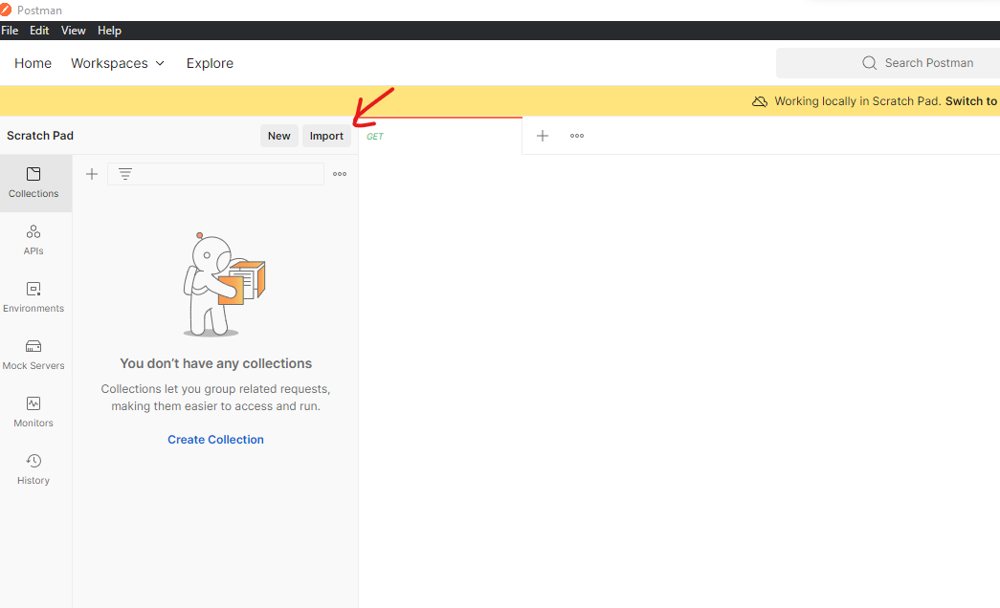
    
    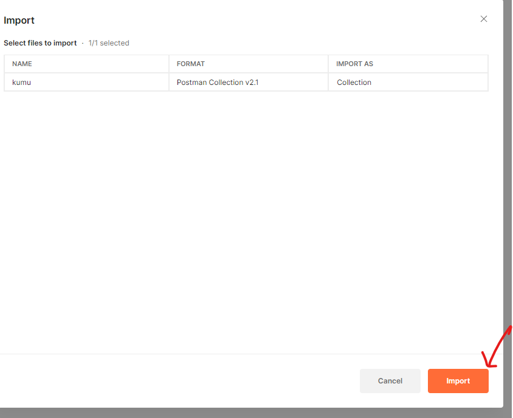

    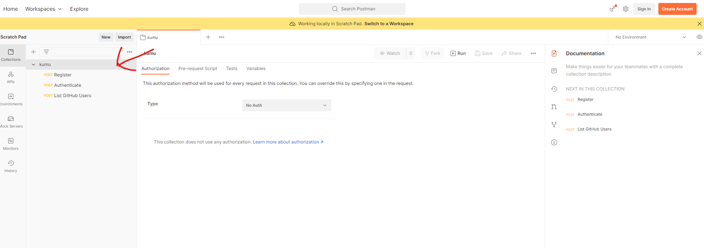

2. Register User

    Click the `Register` request on the collection.

    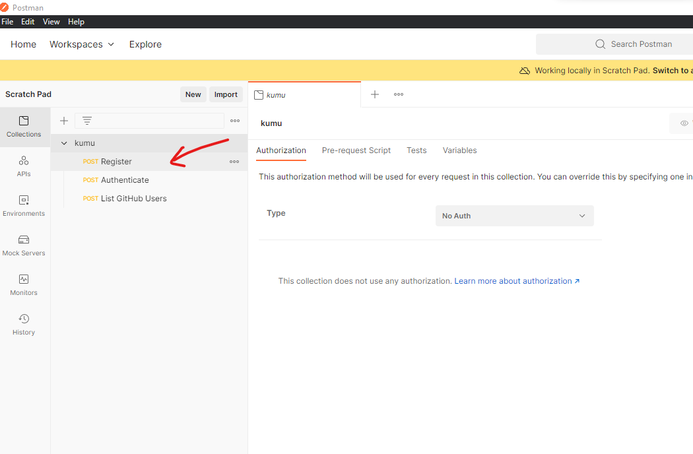

    Go to Body -> GraphQL

    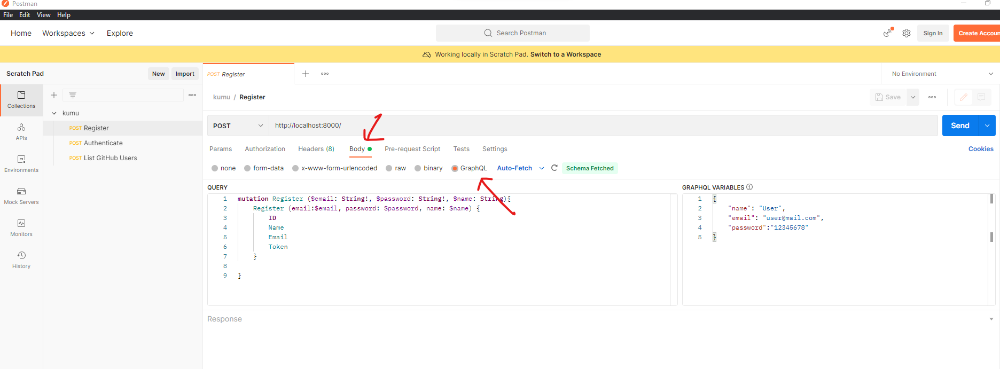

    The `QUERY` and  `GRAPHQL VARIABLES` fields should already have sample content.

    You may change the variable values as you please.

    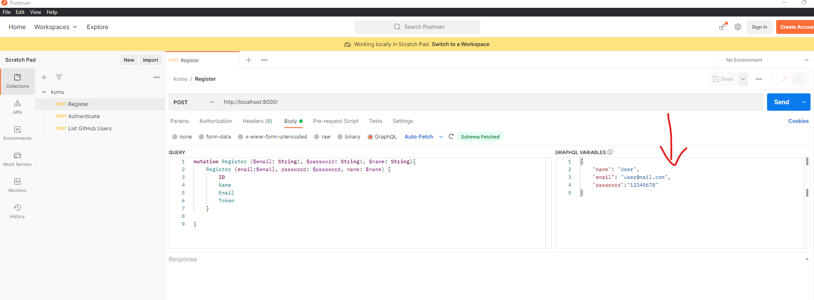

    But take note to only change the values.

    Click the `Send` button.

    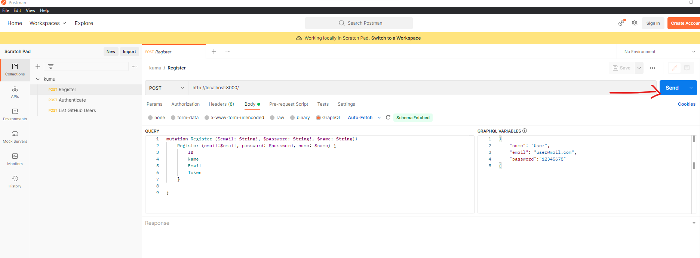

    You will see a result similar to the following:

    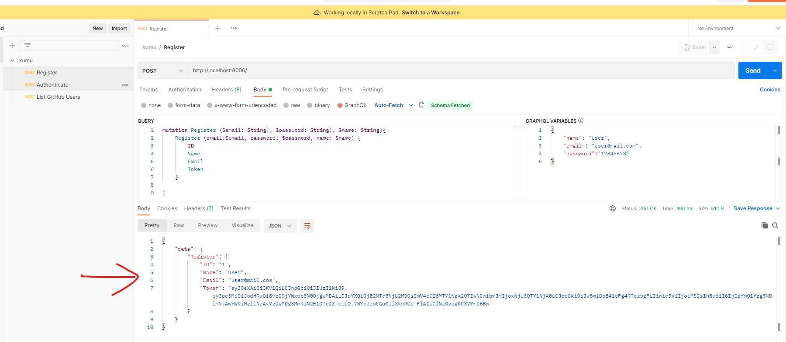

3. Authenticate

    Click the `Authenticate` request on the collection.

    
    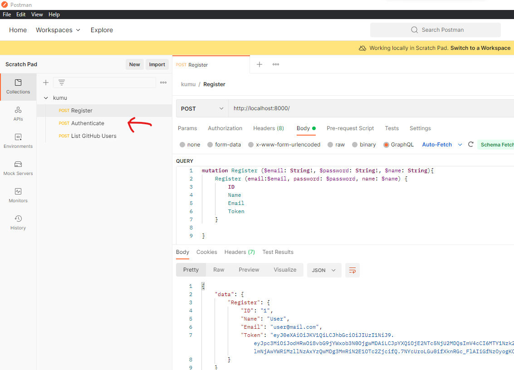

    Go to Body -> GraphQL

    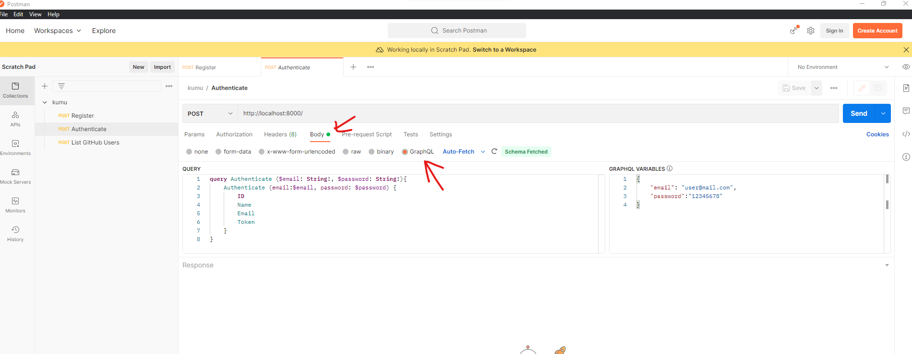

    The `QUERY` and  `GRAPHQL VARIABLES` fields should already have sample content.

    You may change the variable values as you please.

    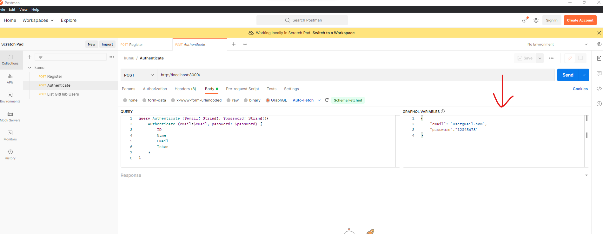

    But take note to only change the values.

    Click the `Send` button.

    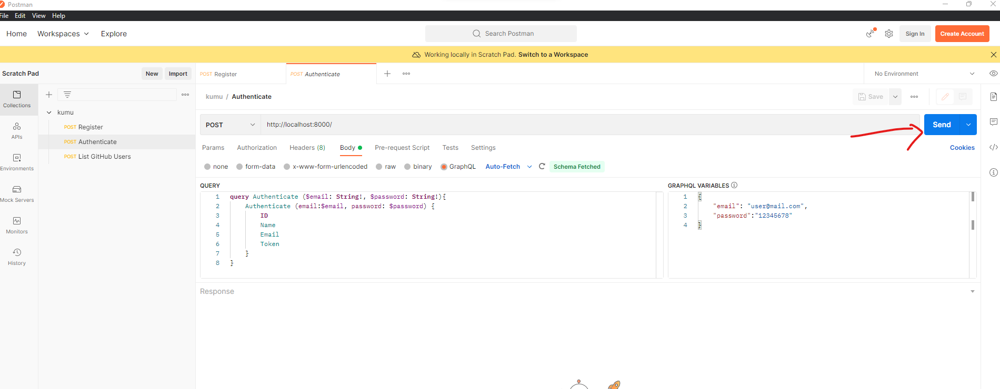

    You will see a result similar to the following:

    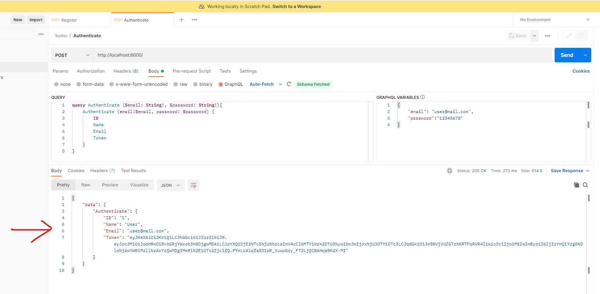


4. List GitHub Users
 
    Click the `List GitHub Users` request on the collection.

    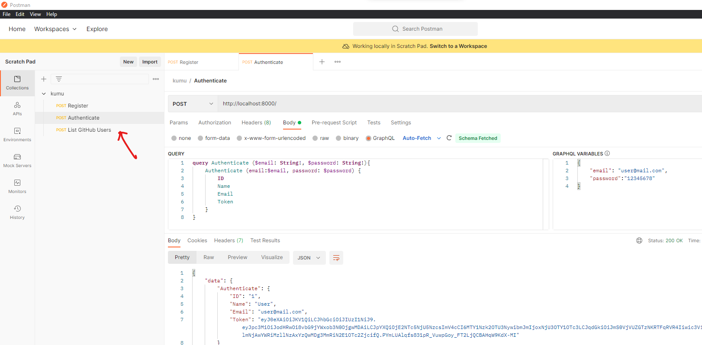

    Go to the `Authorization` Tab.

    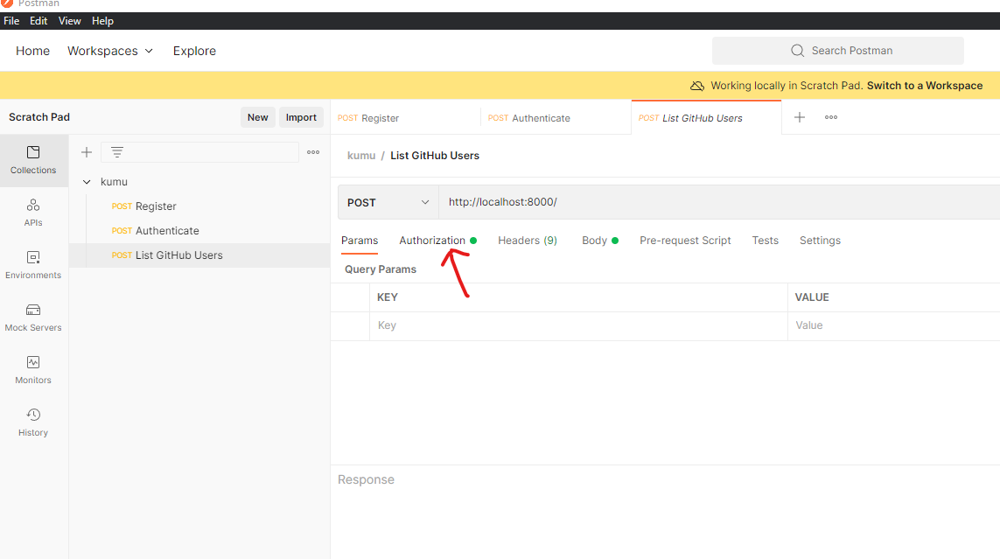

    Set `Type` to `Bearer Token`.

    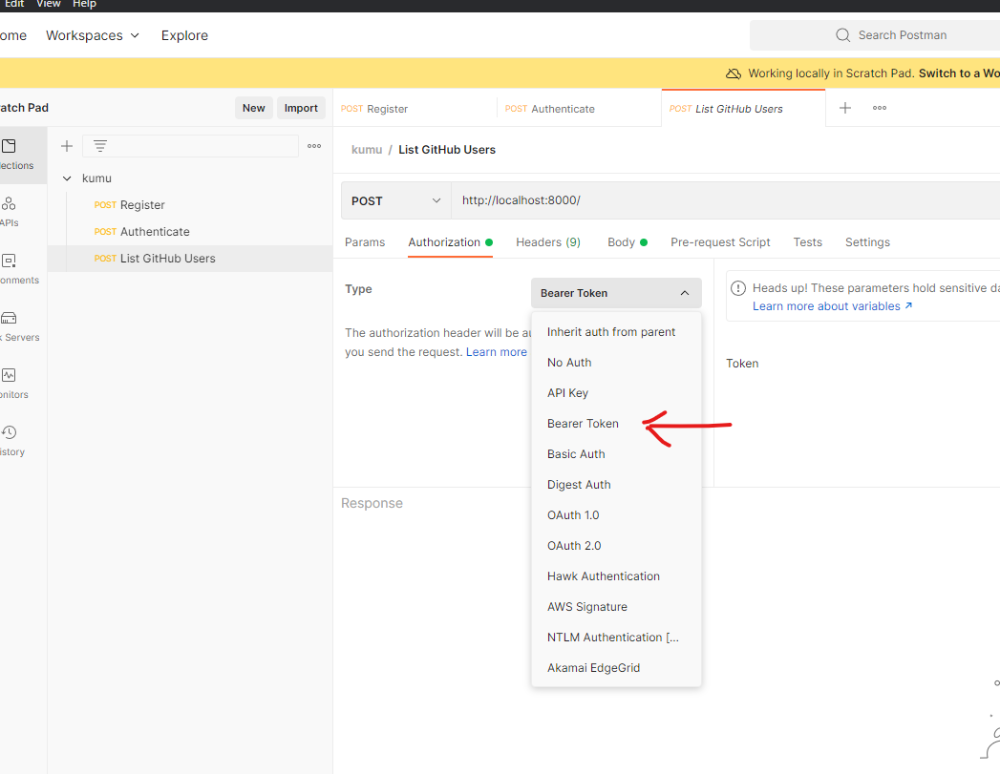

    Paste the `Token` you got from a valid `Authenticate` call to the Token field.

    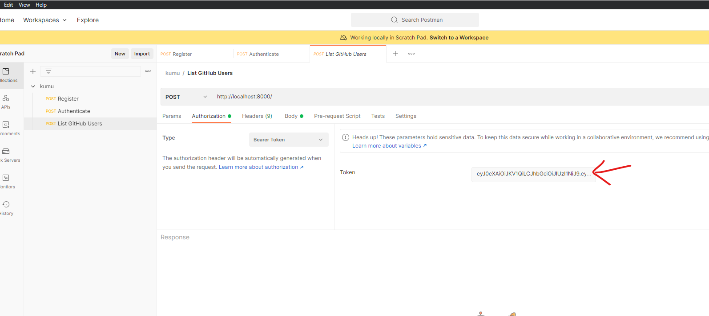

    Go to Body -> GraphQL

    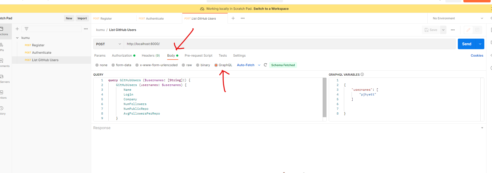

    The `QUERY` and  `GRAPHQL VARIABLES` fields should already have sample content.

    You may change the variable values as you please.

    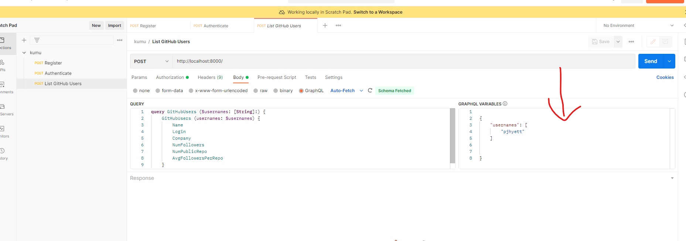

    But take note to only change the values.

    Click the `Send` button.

    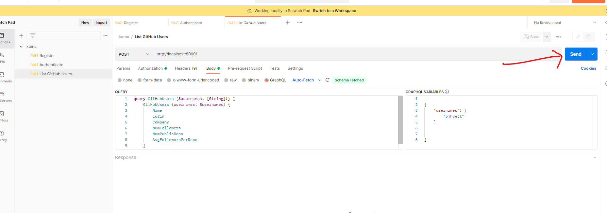

    You will see a result similar to the following:

    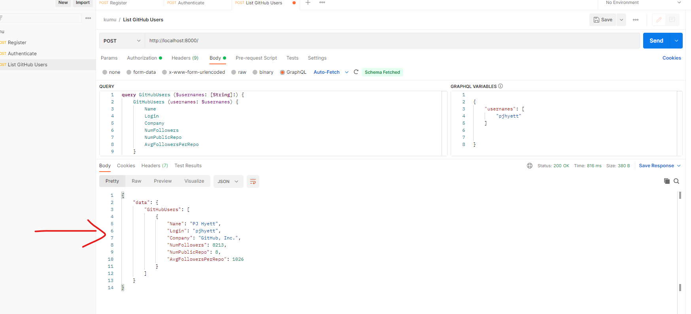


### How to check if Redis had been integrated

Since the `Redis` server is containerize, you will need to access the container shell to monitor your `Redis` server.

First thing to do is to know the name of the container by using the following command:

```shell
./vendor/bin/sail ps
```
You will see a list of the running containers and take note of the `Name` of the `Redis` container.

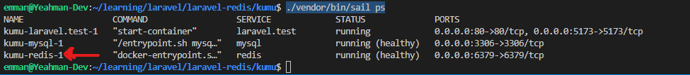

On the example, the name of the `Redis` server is `kumu-redis-1`.

Based on that name, you can do the following command:
```
docker exec -it kumu-redis-1 redis-cli MONITOR
```

In any case your container is named something else, then replace the `kumu-redis-1` with the name of your containerfrom the comand above.


## Bonus Challenge (Optional)